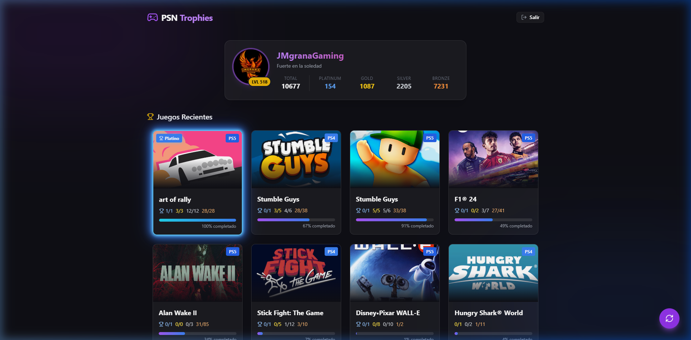
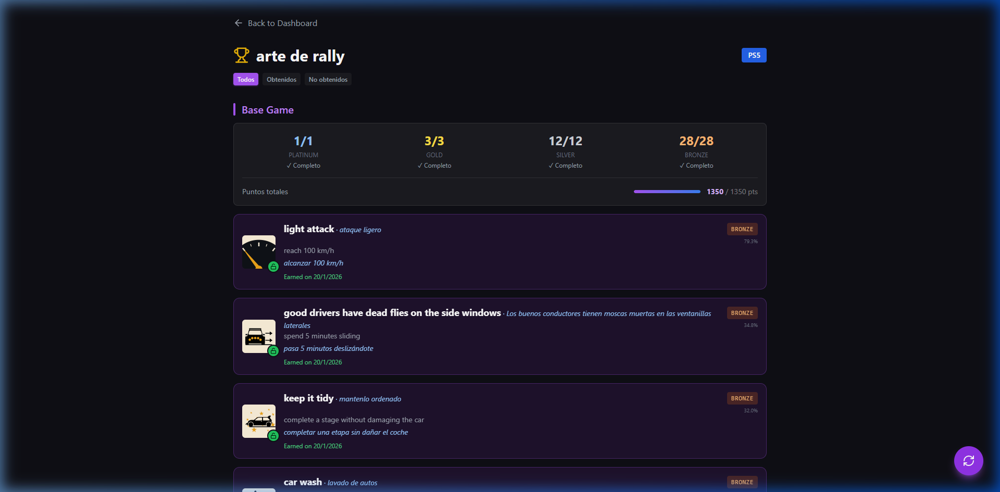

# 🎮 PSN Trophy Viewer

A modern, high-performance React application for viewing your PlayStation Network trophies with detailed statistics, smart grouping, automatic translations, and a premium neon UI.




## ✨ Features

### 🔐 Secure Authentication
- **Dynamic Login**: No more editing `.env` files. Login directly through the web interface.
- **NPSSO Guide**: Built-in step-by-step instructions on how to obtain your secure token.
- **Persistence**: Remembers your session using secure local storage.
- **Multi-Device**: Works seamlessly on PC and Mobile.

### 🏆 Advanced Trophy & Stats Tracking
- **Complete Library Sync**: Bypasses standard limits to load your **entire** game library history using PSN API pagination.
- **Play Time Tracking**: Matches and displays total hours played across your games (works automatically for PS4/PS5 titles with playtime data recorded by PSN).
- **Top 20 Leaderboard**: A dedicated page showcasing your top 20 most played games, featuring animated progress bars and premium podium styling.
- **Smart Grouping**: Automatically separates base game trophies from DLC/Add-on packs.
- **Total Points System**: Calculates and displays the earned vs. total PSN points per DLC/Game (Platinum=300, Gold=90, Silver=30, Bronze=15).
- **Spanish Translation**: Automatic machine translation for all trophy titles and descriptions, displayed elegantly inline.
- **Auto-Sorting**: Trophies are automatically sorted by rarity (rarest first) for a better overview.

### 🎯 Pro Dashboard & UI
- **Neon Highlights**: Games with a Platinum trophy glow with a triple-layered cyan/blue neon effect. Games with 100% completion (but no platinum) glow with a premium gold aesthetic.
- **Responsive Layout**: perfectly centered interfaces (`flex`, `items-center`) that adapt naturally to ultra-wide displays and smartphones.
- **Platform Badges**: Visual indicators for PS5, PS4, PS3, and Vita titles.
- **Smooth UX**: Powered by Framer Motion for elegant hover behaviors, scale effects, and transitions.



## 🛠️ Tech Stack

**Frontend:**
- **React 18** (Vite)
- **Tailwind CSS** (Styling)
- **Framer Motion** (Animations)
- **Lucide React** (Iconography)
- **Axios** (API Management)

**Backend:**
- **Node.js + Express**
- **psn-api** (Official PSN Integration)
- **Vercel Serverless Functions** (Cloud Deployment)
- **Google Translate API** (Automatic Translation)

## 🚀 Getting Started

### Local Development

1. **Clone & Install**
   ```bash
   git clone https://github.com/JMgranaBUAB/psn-react.git
   cd psn-react
   npm install
   ```

2. **Run the App**
   ```bash
   npm run dev
   ```
   - **Frontend**: `http://localhost:5173`
   - **Backend**: `http://localhost:3001`

### 📱 Mobile Access
To use the app on your phone during local development:
1. Ensure both devices are on the same Wi-Fi.
2. Check the terminal output for the **Mobile URL** (e.g., `http://192.168.1.45:5173`).
3. Open that URL on your phone!

### ☁️ Cloud Deployment
This project is pre-configured for **Vercel**:
1. Push your code to GitHub.
2. Connect your repository to Vercel.
3. Done! The project will automatically deploy using Serverless Functions.

## 📁 Project Structure

```
psn-react/
├── api/                # Vercel Serverless Functions (Backend)
├── src/
│   ├── components/     # UI Building blocks (TrophyCard, UserProfile)
│   ├── pages/          # Full page views (Login, GameTrophies, Home)
│   ├── App.jsx         # Routing & Auth Logic
│   └── index.css       # Tailwind & Global styles
├── server.js           # Local Express proxy server
├── vercel.json         # Cloud deployment config
└── package.json        # Dependencies & Scripts
```

## 🎮 How to Login (NPSSO)

The app requires an `NPSSO` token to access your private trophy data securely.
1. Use the **integrated guide** on the login page.
2. Log in at [PlayStation.com](https://www.playstation.com).
3. Visit [ca.account.sony.com/api/v1/ssocookie](https://ca.account.sony.com/api/v1/ssocookie).
4. Copy the 64-character code and paste it into the app.

---

## 🤝 Contributing
Contributions are what make the open source community such an amazing place to learn, inspire, and create. Any contributions you make are **greatly appreciated**.

## 📝 License
Distributed under the MIT License. See `LICENSE` for more information.

## 📧 Contact
**JMgranaBUAB** - [GitHub](https://github.com/JMgranaBUAB)

---
⭐ **Give this project a star if it helped you track your trophies!**
